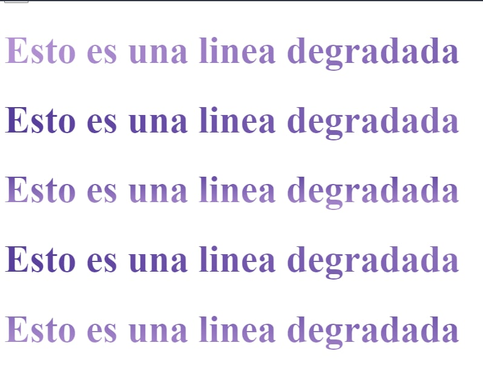

# Efectos-css

 efectos y animaciones con HTML y CSS

## Capturas

**Linear gradient**:

**Radial gradient**:

**Conic gradient**:

**Fondo de imagen a texto**:

**Sobra a texto**:

**Texto 3D**:

**Tipografía maquina de escribir**:

**Animación a tipo de texto**:

**Multiple animación a texto tipo maquina de escribir**:

**Degradado animado en texto**:

